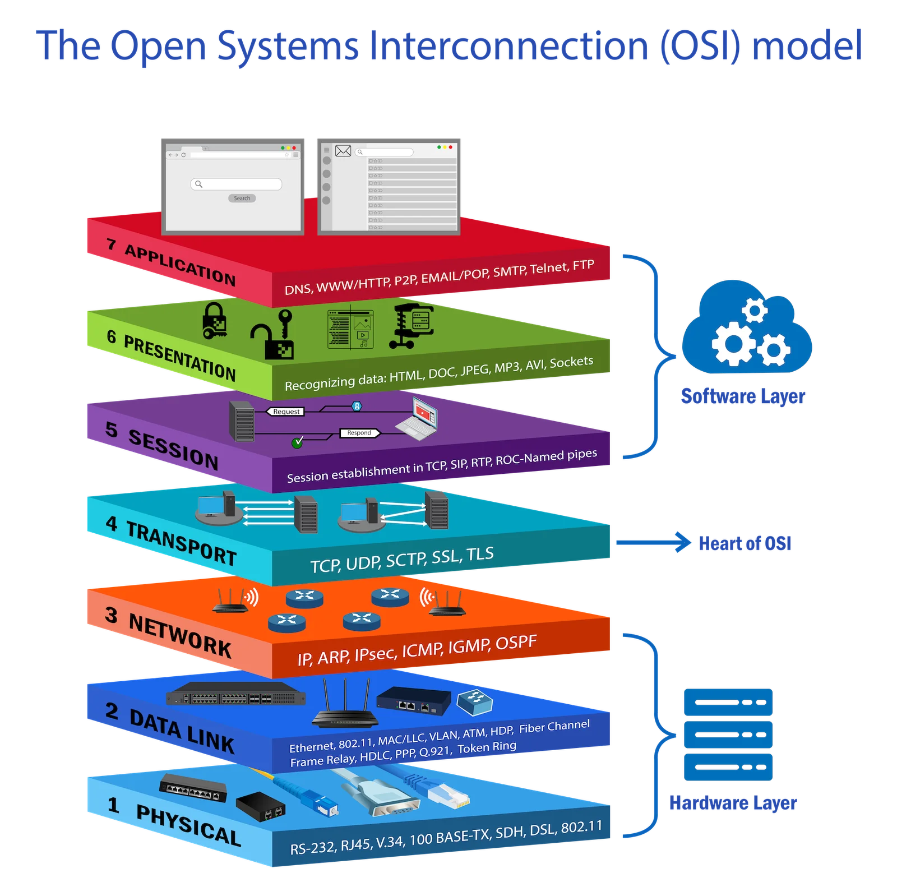
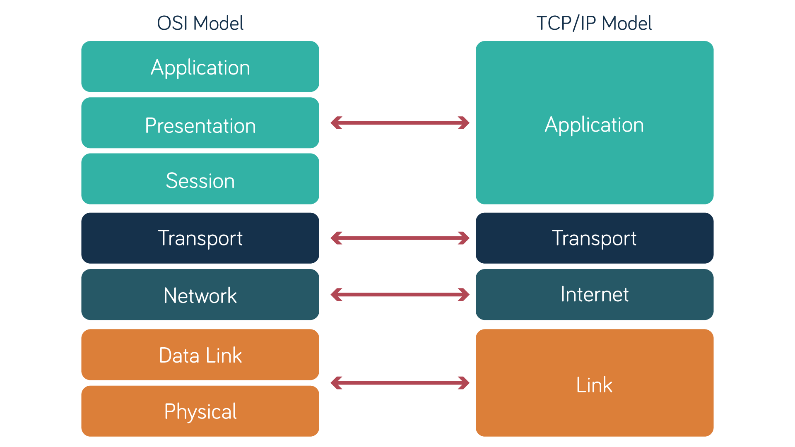

# Moment A: Avancerad Nätverksanalys &amp; Trafikflöden (Mål 3)  

**Jag ska rita och förklara ett komplett datatrafikflöde från en klient i labbmiljön,
genom lokalt subnät, via gateway/router och DNS-uppslagning, ända fram till en målserver i
molnet/internet.**  
**Resonemanget ska inkludera hur pakethuvuden (MAC, IP, Port) ändras eller
används på respektive skikt i TCP/IP-modellen.**  
***  
###  
**⬇️OSI Model:⬇️**
  
**⬇️TCP/IP Model:⬇️**  

  

***  
### *VIKTIGT:* Jag kommer gå genom varje OSI-Layer 7-1 (uppifrån neråt).  
***---Senario***: **Klient** `192.168.1.50/24` surfar till `https://example.com` via **Gateway:**`192.168.1.1` 

#### ***OSI-Layer 7:** `Application-Layer.`* |> ***TCP/IP-Layer 4* `Application-Layer.`** 
- **DNS:** Eftersom dator inte förstår våra bokstäver, utan bara siffror. Har vi en `DNS-server` (tabell) lagrar **`webbsida = Ip-address`**.  
När du besöker `example.com` i din webbläsare, då frågar din dator DNS-server **vad betyder `example.com`**, DNS-server letar inne i sin tabell och svarar att `example.com = 94.184.216.35`.  
Du ser på din skärm `example.com` men i bakrunden din dator ser `94.184.216.35`  

- **Cache:** Nu när dator fick veta att `example.com = 94.184.216.35` så sparar din dator det i `webbläsare-minne(Cache)`, istället för att fråga `DNS-server` om samma address varje gång.  

- **HTTP/HTTPS:** Det är protokoller man använder för att berätta för sidan vad man vill ha.  
  - `HTTP bor på port 80` Används sällan, eftersom det kommnkationen mellan dig och webbsida är i plaintext (vem som helst kan läsa) osäker protokoll.  
  - `HTTPS bor på port 443` Används idag. Mycket säker eftersom kommnucation mellan dig och websidan är `krypterad`, bara du och webbsidan kan förstå varandra.  

> **Du kan fråga din DNS-server om vad en sida har för Ip-address genom `nslookup example.com`.**  
***
#### ***Layer 6:** `Presentation-Layer.`* | ***TCP/IP-Layer 4* `Application-Layer.`**  

- **Kryptering:** Ändrar läsbar text `(Plaintext)` **till** oläsbar text `(Chiffertext)` genom avancerade metoder/ekvationer (`Symmetrisk och Asymmetrisk`).  
  - ***`Symmetrisk`=*** Snabb, krypterar stora mängder data. Aktiveras efter att `Authorization` (what data u can access/change)är klar.  
Skyddar `Confidentiality` (gör data oläslig för utomstående).  
`1 Shared Secret-Key` för encryption och decryption, **Algoritmer:(DES,3DES,AES,S-AES,S-DES)**  
  
  **-Viktig:** För att dela denna `1 Shared Secret-Key` med mottagaren, Kan vi inte skicka det klartext via internet, Istället får man hjälp av `Asymmetrisk / Diffie-Hellman även Certifikat` för att öppna säker (tunnel), sedan växlar man tillbaka till Symmetrisk. Eller nyckel kommer man överens om med fysiskt träff.  
  
   - ***`Asymmetrisk:`*** Seg Kräver mycket processorkraft (tunga matematiska operationer = stora primtal/elliptiska kurvor), därför används den bara för att öppna tunneln + signera, sedan växlar man till `Symmetrisk` för bulk-data. har `1 Private-Key` + `1 Public-Key`, små mängder data (Key, signaturer, hashar). Aktiveras FÖRST (under handshake), innan `Symmetrisk` tar över. Säkrar inloggningar (certifikat) och delar ut Symmetriska nyckel (`1 Shared Secret-Key`). Sköter `Authentication` (BankID/Certifiering) och `Non-repudiation` (avsändaren kan inte neka). Skyddar `Integrity` (via digitala signaturer). Den är `PKI (Public Key Infrastructure)`.  **Algoritmer:(RSA,ECC,DSA,DH,ECDHE,ElGamal)**

- **Certifikat:**  Vi säger att du köper en ny dator (Windows) när dator ska börja kommunicera med webbläsare, följande händer i bakgrund.  
  
  1: Klienten genererar `1 Private-Key` (stannar på maskinen), `1 Public-Key` packas ihop med identitetsuppgifter till en **CSR - Certificate Signing Requests.**  
2: **`RA (Registration Authority)`** tar emot **(CSR)** och avgör om uppgifterna är sanna.  
3: **RA** frågar **`DC (Domain Controller)`*(AD)*** “finns den maskinen i domänen och stämmer uppgifterna?”  
4: **DC** svarar att maskinen är ett giltigt domänobjekt.  
5: **RA** godkänner **CSR** och skickar den vidare till **`CA (Certificate Authority).`**  
6: **CA** litar på **RA** och godkänner enligt sin policy. **CA** issues och signerar *certifikatet* med sin egen `Private-Key`.  
  7. *Certifikaten* installeras hos klient och kopplas ihop med klient `Private-Key`.  
  
  **`CRL (Certificate Revocation List)`** = Lista med serienummer på (återkallade) certifikater.  
**`OCSP (Online Certificate Status Protocol)`** = real-time certificate status check.

- **Encoding:** sändare och motagare kommer överens om att bestämma en protokol till hur bokstäver ska se ut, annars blir det konstiga tecken på skärmen, en metod är **UTF-8**.  
***  

#### ***OSI-Layer 5:** `Session-Layer.`* |> ***TCP/IP-Layer 4* `Application-Layer.`**  

- **socket:** Tänk dig du kan öppna flera flikar i din webbläsare. Du öppnar youtube i en flik, då kommer socket skriva såhär `(min pc ip:) 192.168.1.50:51234 (<-en öppen port i min dator) | (YT-sida Ip:)93.184.216.34:443 (<- Via 443-HTTPS-port-YTsida)`, sen öppnar du Netflex i ett annat flik så skriver socket `(min pc ip:) 192.168.1.50:51235 (<-en öppen port i min dator)| (NF-sida Ip:)94.174.116.25:443 (<- Via 443-HTTPS-Port-NFsida)`, som du märker jag kan ansluta mig till samma port från utsidan men använder olika portar på min dator. Påsåsätt alla dina flikar går inte in i varandra, allt är organiserar. Youtube tar rummet (porten **51234**) från din dator och Netflix tar rummet (porten **51235**) olika rum olika kontakter så det inte går in i varandra.  

- **Session:** När du öppnar en flik(hemsida) server skapar en session om dig där det sparar `username:bilal,kundvagn:tröja,Inloggad:ja`, server skikcar tillbaka en **`Session-ID (ses-92748229)`** som sparas i din webbläsare(Cookies),Nu varje gång din webläsare skickar en signal via **(socket)** skickas din (Cookie) automatiskt med så att hemsidan du surfar på känner igen dig sen tidigare. därför kan du se att saker du la i din kundvagn fortfarande finns kvar(tröja).  
***

#### ***OSI-Layer 4:** `Transport-Layer.`* |> ***TCP/IP-Layer 3* `Transport-Layer.`**   
- **Port:** Varje dator har exakt `65 535` Portar. Vi har 3 olika Port katalog..  
    - **`0 till 1023` (välkända portar)** registerarde på välkända protokoller/tjänster som Port 80 =HTTP, Port:443=HTTPS Port:22=SSH osv..  
   - **`1024 till 49151` (Registrerade portar)** används av en specefik app/program på din enhet.  
   - **`49152 till 65535` (Dynamiska Portar)** en tillfärligt Port som din dator skapar när du ska surfa på internet för att kunna ta emot datatrafik.  
>  **Du kan se dina egna öppna portar genom `ss -tunp` i *Linux*, och `netstat -an` i *Windows*. I *Windows* kan du även se väldigt bra info genom...**  
**`Task Manager > Performance > Välj ditt nätverks kort > uppe till höger (...) tryck på dom > Resoure Monitor > här har du tabbelerna för Network, TCP, Listning ports.`**  

- **TCP (Transmission Control Protocol):** Fokus på Kvalitet (missar ingen bit) (seg).  
TCP är ett anslutningsorienterat protokoll. Innan data skickas måste en "Three-Way Handshake" ske för att etablera en session.  
  
  - **Buffra data:** Normalt kan datorn samla (buffra) lite data innan den skickar vidare det.  
  - **Flags:** Bitars kontrollinformation (SYN, ACK, FIN, RST, PSH, URG). De styr paketets syfte.  
  - **MSS (Maximum Segment Size):** Den största mängden data som får plats i ett segment.  
  - **Window Size:** Hur mycket data som kan skickas innan en bekräftelse (ACK) krävs.  

- **UDP:**  Fokus på snabbhet, bryr sig inte om flera packets tappas på vägen, vädligt osäker eftersom det sker inte nått form av `Hand shake`, utan data skicaks ut utan kontroll. hahah Trots all problem den skapr så gillar jag den fortfarande. Eftersom `spel,telefonsamtal,videosamtal` osv.. anvädner den. Tänk du pratar emd din kompis i ett annat land, det skicaks packet sen om något packet `tappas bort` på vägen och din vän inte hörde vad du sa, då kan din vän bara be dig att upprepa det du sa. 

#### ***OSI-Layer 3:** `Network-Layer.`* |> ***TCP/IP-Layer 2* `Network-Layer.`**  

- **Ip-address och Gateway:** `Interna Nätverk` Varje enhet tilldelas en `Privat Ip` via Router automatiskt `DHCP`, du kan själv även välja en statist ip address.  
En **`SUPERVIKTIGT`** när dina `intern ip` ska **nå WAN `internet`** då Interna-enheter skicakr frågan till sitt **`Gateway (Router Porten)`**, din Router ser det är **Intern Ip** som inte får komma ut till det vilda `WAN (Internet)` så din Router sprar info i sitt minne, `Pc1 med ip 192.169.2.1` vill nå `Facebook`, din Router suddar ditt privata ip så det inte syns, och skriver istället **Routers Publica Ip** som den fick tilldelat av **ISP**. skicakr och tar emot med `Gateway Ip Roters Publica Ip`. 

  - ***Klass A***  
**För:** väldigt stora nätverk (ISP)  
**Första talet:** 1–126    /8  
**Privat:** (Första ocktet måste vara 10 då är det privat nätverk) 10.x.x.x = privat nätverk  
**public:** (Första ocktet ha nummer 1 till 126 (förutom 10) då är det public network) 1 - 9 sen 11 - 126.x.x.x  = **public:** network  
**Subnet:** mask: 255.0.0.0  
**Antal:** (miljontals) av enheter.  

  - ***Klass B***  
**För:** Medelstora nätverk till Medelstora företag, universitet  
**Första talet:** 128–191 /16  
**Privat** (Första ocktet måste vara 172, och andra ocktet måste vara ett nummer från 16 till 31 då är det Privat network) 172,16 - 31,x,x det är Privat network  
**Public** (Första ocktet ha nummer 128 till 191(förutom om det börjar på 172.16 till 172.31) då är det public network.) 128 - 191.x.x.x förutom 172,16 - 31,x,x  
**Subnet mask:** 255.255.0.0  
**Antal:** Tusentals enheter  

  - ***Klass C***  
**För:** Små nätverk (vanligast i skolor, hem, företag)  
**Första talet:** 192–223 /24  
**Privat:** (Första ocktet måste vara 192, och andra ocktet måste vara 168 då är det privat nätverk) 192.169.x.x då är det privat nätverk.  
**Public:** (Första octet ha nummer 192 till 223 (förutom om det börjar på 192.169.x.x)då är det public network).  
**Subnet mask:** 255.255.255.0  
**Antal:** Upp till 254 enheter

  
- **TTL (Time To Live):** För att din packet ska nå destenation. Åker den genom olika Routers tills den når destinationen. Men eftersom din pcket landar hos **olika Routers som i sin tur skickar vidare till olika Routers**, då kommer det skapas en **bult (flooding)** ut skickadende och när din packet har nått fram till sitt destination, så sitter andra Routers ftf och skicakr vidare, eftersom det inte vet att din packet har kommit fram till sitt destination. För att packet ska inte skicakr över hela tiden och skapa en `Routing Loop`, då har man gjort en timer till packetet. **TTL** hjälper oss slippa denna **(Routing loop)** genom att din router skriver ett nummer på pakcet som 64, nu varje ny router tar emot pakcet då ska den `minska -1 från 64`, så skciaks den tills det når 0 och då dör packetet, så har man sätt ett liv till packet.  

- **OSPF (Open Shortest Path First)** Använder **bandwidth (kabel hastighet att skicak data)** för att bestämma vilken väg ditt packet ska ta över internet, OSPF väljer den snabbaste vägen, spelar ingen roll hur många hopp/stopp finns på vägen, sålänge kablarna har snabba **bandwidth**.  
- **RIP (Routing Information Protokoll:)** Till skillnad från OSPF, RIP bryr sig om hur många stopp/hopp ditt packet kommer ta för att nå destinationen, RIP bryr sig itne om hastighet, Rip är gammal och används inte så mkt. 

> **Du kan se vilken väg din packet tar med `ip route` även följa hela resan med `traceroute example.com`**  
***

#### ***OSI-Layer 2:** `Data_Link-Layer.`* |> ***TCP/IP-Layer 1* `Link-Layer.`**  
- **ARP-tabllen:** En tabell i din enhet (Router, Pc, telefoenr osv..). Sparar `intern data` som `Private-Ip + MAC` att `Ip 192.168.1.2` bor på enheten med `MAC: 00:1A:8B:3c:4D:5E`. Om du skriver ping 192.168.1.2 står inte addressen i din aRP-tabell då skriker din dator ut i hele ditt intern nätverk `Broadcast` och letar efter enhet med Ip 192.168.1.2, sen din pc2 svarar a jag heter Ip 192.168.1.2 då komemr svar tilbaka och då sparas Ip 192.168.1.2 i din arp så du slipper ropa varje gång.  

- **MAC-adress** Används vara i ditt **`intern nätverk` (Lämnar aldrig ditt lokala nätverk)**. Består av 6 fält, och varje fält har 2 tecken. Den ser ut så här: **`00:1A:8A`:3C:4D:5E**  
  - De första 3 fälten **`(00:1A:8A)`** kallas **OUI** och visar alltid **tillverkaren** (Samsung, Apple,Microsoft osv..).  
  - De sista 3 fälten **(3C:4D:5E)** är för just den **specifika enheten.**

  - **Tillfällig MAC-adress (Random MAC):** En falsk MAC-adress som din enhet hittar på själv för att skydda din integritet. Då blir det svårare för olika Wi-Fi-nätverk att känna igen och spåra din enhet.

  **Så här går ett paket ut på internet:**

1. Din enhet skickar paketet till din router. I paketet står **din enhets MAC-adress** som avsändare och **routerns MAC-adress** som mottagare.
2. Routern byter din **privata IP** `(192.168.1.50/24)` mot din **publika IP** `(Gateway:192.168.1.1)`, som du fått från din **ISP** det kallas **NAT**.
3. Routern tar bort den gamla MAC-adressen och sätter på en ny, med **sin egen WAN-MAC-adress** som avsändare. Sedan skickar den paketet vidare till **operatörens nästa router**.
4. Efter det rörs inte IP-adresserna (din publika IP och mottagarens IP). De följer med hela vägen.
5. På varje hopp, från router till router, byts MAC-adresserna ut mot nästa hopps(Router) MAC-adress.

(**Kort sagt:** MAC-adressen gäller bara **ett hopp i taget**. IP-adressen gäller **hela vägen**. Därför kan destinationen se din routers **publika IP**, men aldrig din **MAC-adress**).

`Om destinationen finns hos en annan operatör...`  
då skickas paketet vidare från din operatör till nästa operatör. Routrarna använder alltid **IP-adressen** för att välja vägen, men mellan varje router används fortfarande MAC-adresser (eller en annan Layer 2-teknik) för att flytta paketet ett steg framåt.

- **Switch:** till skillnad från **HUB** som användes förut som skicakde frågorna ut till alla sina Portar.  **Switch** Lär sig vilken MAC-adress är kopplade till vilken port och sprar det i sitt **Mac-address tabellen**. Vi säger att du har en **Pc1-,Pc2,Pc3** som kopplade till **Switch port 1,2,3**, om Pc1 pingar Pc3, då går signalen till **Switch** sen tittar **Switchen** i sitt Mac-address tabell coh ser att frågan sak till MAC=pc3 då skicakr den ut det på endast sitt port 3, så att andra datorer i nätverk inte får medelandet.  

- **vNIC/NIC:** Du kan se att dina `Viretuell Maskin(VM)` har ett annat **default gateway** än vad din `Host` har, detta eftersom dessa `Viretuell Maskin(VM)` bor på din `Host` så det använder en **osylig `(vNIC)` inuti din `Host`** och då är det den som heter `Default Switch` **(`(Vnic)nätverkskortet` för `Viretuell Maskin(VM)`)** Med andra ord din `Host` är `Switch + router + DHCP-server + DNS-forwarder` för dina `Viretuell Maskin(VM)`.  
  
  Om du vill ut på internet via din `Viretuell Maskin(VM)` skickas packet till din `Viretuell Maskin(VM)` `Gateway` som är din `Host`.  
`Host` Skickar vidare till sin `gateway` (Router).  
(Router) skickar vidare packet via `(RIP eller OSPF)` alltså packet mellanlandar hos flera Routerar innan den når destenation.  
> **Man kan se sin ARP-tabbel i Linux `ip neigh` och `arp -a` i Windows** 
***

#### ***OSI-Layer 1:** `Physical-Layer.`* |> ***TCP/IP-Layer 1* `Link-Layer.`**  
***VIKTIGT:* Dator förstår endast `på(1) | Av(0)`**
- **Kablarna:** Här är det fysiska, för att data ska nå fram skcikas det genom kablarna.  
Kopparkablar som **cat6** skicaks elektrisak pulsar som av,på,på,av osv..

- **Twisted Pair(Kopparkabel):** Skickar elektrisaka pulsar som `av,på,på,av`. Standart för lokala nätverk (LAN). Den består av åtta koppartrådar tvinnade i par för att motverka störningar. har en plast huvve som sitter på kabel som då kallas **RJ45-kontakt**.  
  
  - **UTP (Unshielded Wtisted Pair):** oskärmad,billig,används i vanliga hem och kontor.  
  - **STP(Shielded Twisted Pair):** Skärmad emd folie. används i tuffa miljö som fabriker för att blockera starka elektriska störningar.  
  - **Cat 5e,6,6a** Ju högre siffra desto bättre är kopparkvaliten och tätare lederna tvinnade inuti. Det gör att kablen klara högre data hantering per sekund. det kan vara både skärmad och oskärmad så att beror på vilken miljö du ska använda det i.  
- **Fiber Optic:** Skicakr data som ljussignaler genom glas och plasttrådar, bandbredd är enorm.  
  - **SMF (Single mod):** Sjuter laser genom extremt tunn glaskärn rakt utan att studsa. räckvidd är flera mil och anvädns av stadnät och internetleverantörer.  
  - **MMF (Multi mode)** Har tjockare kärn och använder LED-ljuset, signalen är snabbare men kortare räckvidd (Max 500 meter). Används inuti datacenters och serverrum.  
- **Trådlös:** Signalen skicaks genom Radiovågorna och når din enhet, på vägen kan det stötta på svårigheter som minskar prestanda, som en betongvägg,träd,allt möjligt, ju mer avstånd mellan dig och masten/router ju sämre uppkoppling.
  - **Wi-fi:** Mäts i **GHz** ju högre **GHz** deutå snabbare och stabilare blir uppkopplingen.  
  - **Mobilnät:** 4G,5G,6G osv.. ju högre siffra ju nyare generation, används utomhus, radiosignaler skicaks från en nära mast till dig och når din telefon.
***  