# VG-Uppgiften (Del B) : Jämförande OS & Behörighetsanalys (Mål 2).

Jag ska demostrera i **Windows/Linux** och skapa 2 grupper med olika behörigheter, med tanke på **arv**.

### ***Jag delade upp det i 5 steg...***  

***steg 1:* Skapa Users**  
- Alice  
- Bob  


***steg 2:* Skapa Grupperna och lägger till Users i Grupperna**  
- g_ledare (Alice) 
- g_personal (Bob)  


***steg 3:* Skapa filen Projekt med två undermappar *(Ledning, Gemensamt)***  
- Projekt  
  - Ledning  
  - Gemensamt  


***steg 4:* Tilldela rätt Åtkomast enligt `arv`**  
- ***Ledning***  
  - g_ledare (Alice)(Läsa/skriva)  
  - g_personal (bob)(Ingen åtkomst)  
- ***Gemensamt***  
  - g_ledare (Alice)(Läsa/skriva)  
  - g_personal (bob)(Läsa/skriva)   


***steg 5:* Testa så att rätt grupp fått rätt åtkomst : JA/NEJ**  

***  
***

# Windows 🖥️⬇️

**Förklarar kommando Windows**  
- **icacls :** Verktyg i windows som styr behörighertna på filer och mappar.
- **net :** Verktyg i windows som styr (Nätverk, användare och grupper)  
- **(OI) :** Gäller för alla filer inne i mappen.  
- **(CI) :** Gäller för alla udnermappar inne i mappen.  
- **(M) :** (Modify/ändra)  
- **(F) :** Full controll
***  


### ***steg 1:* Skapa Users**
- Alice  
- Bob  

**Computer mangement (run as admin) > Det ska finnas här `Local Users and Groups` men i min VM syns det inte.. spännande.**

***Jag får skriva det i CMD istället...***

**`CMD > run as admin > yes > skriv koden nedan`**
```Bash  
#Formaten.. 
#net user [namn på användare] [lösenord] /add

net user Alice alice /add  #skapar användare Alice som har lösnord alice
net user bob bob/add #skapar användare bob som har lösenordet bob
```    
**VIKTIGT:** Users är nu skapde/registrerade men dom sysns inte i `C:\Users` efetrsom man måste logga in i dessa konto först för att det ska komma in i `C:\Users`.

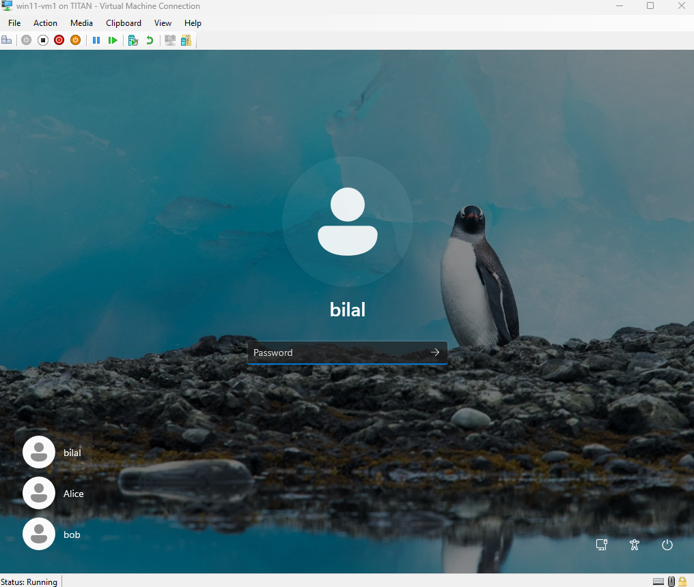


***


### ***steg 2:* Skapa Grupperna och lägger till Users i Grupperna**  
- g_ledare (Alice) 
- g_personal (Bob)  

```BASH  
#`net` använd ditt verktyg `localgroup` som är gjort för lokala grupper och lägg till dessa ändringar...

net localgroup g_ledare /add #skapar gruppen (localt) g_ledare  

net localgroup g_ledare Alice /add  #lägger till User `Alice` i gruppen g_ledare.  

#----------

net localgroup g_personal /add #Skapar gruppen (lokalt) g_personal
net localgroup g_personal bob /add  #lägger till `bob` i gruppen g_personal.

net localgroup #[gruppens namn] #visar vilka finns i gruppen.
```  


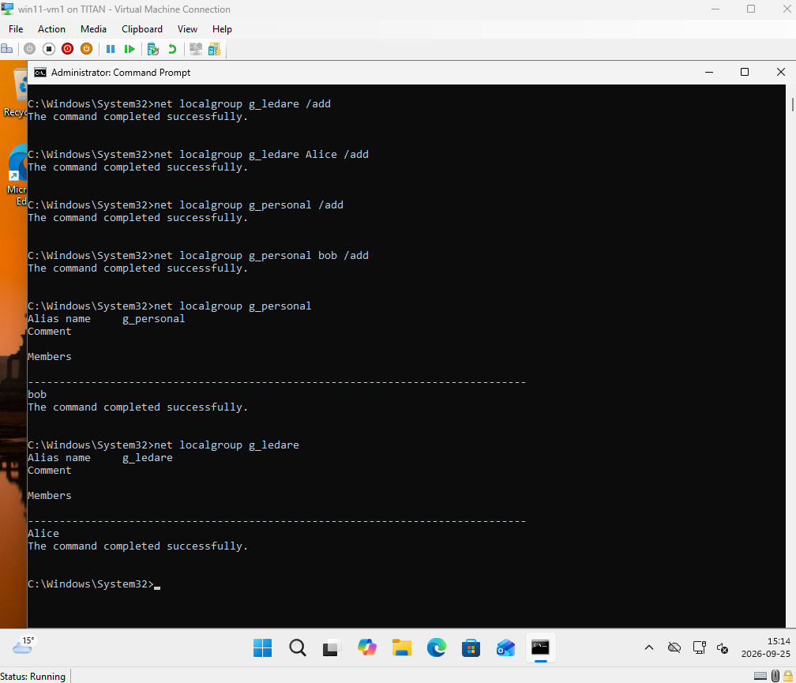 

***  


### ***steg 3:* Skapa filen Projekt med två undermappar *(Ledning, Gemensamt)***  
- Projekt  
  - Ledning  
  - Gemensamt  

**VIKTIGT: Dessafielrna kommer ligga direkt på `C:\` eftersom om jag skapar dessa filer på en User (Public, bob, Alice, Bilal ) då kommer windows blockera andra från att titta i, därför väljer jag att skapa det på `C:\` så att alla har åtkomst till**  

```BASH  
c:\> mkdir projekt  
c:\Projekt> mkdir Gemensamt  
c:\Projekt> mkdir Ledning  
```  
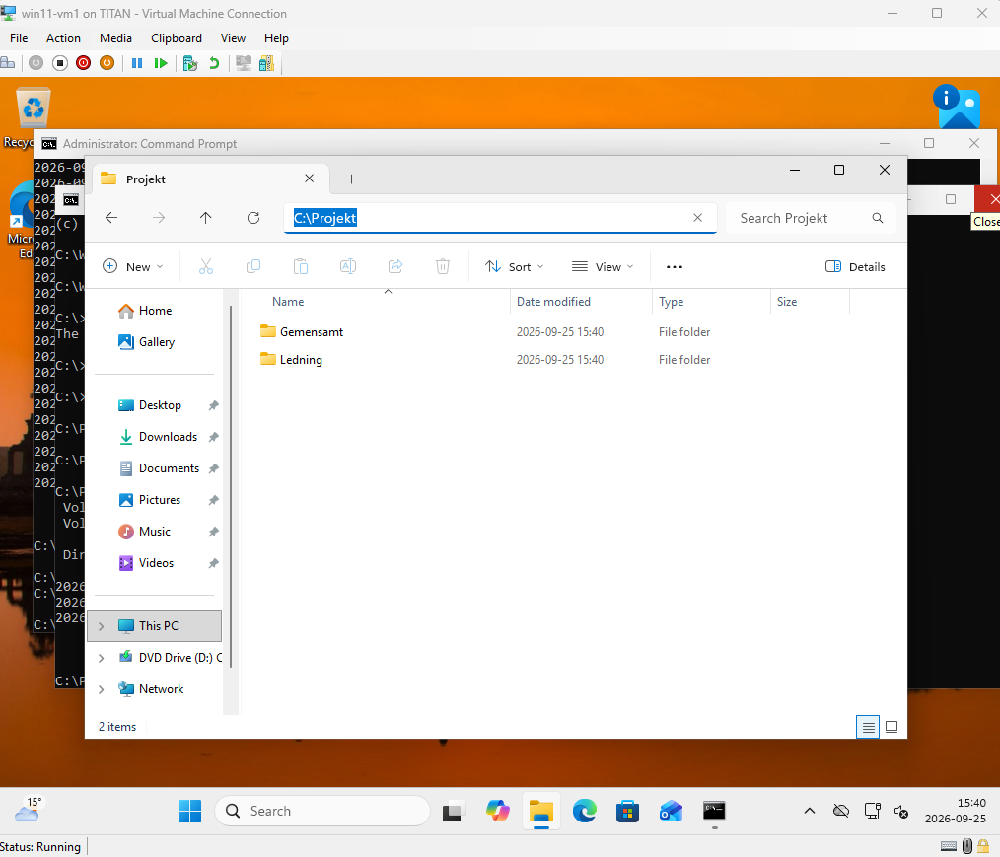

***  


### ***steg 4:* Tilldela rätt Åtkomast enligt `arv`**  
- ***Ledning***  
  - g_ledare (Alice)(Läsa/skriva)  
  - g_personal (bob)**(Ingen åtkomst)**  
- ***Gemensamt***  
  - g_ledare (Alice)(Läsa/skriva)  
  - g_personal (bob)(Läsa/skriva)  


**Ställer in behörigheterna för *Gemensamt*..**
```BASH  
icacls c:\Projekt\Gemensamt /grant g_ledare:(OI)(CI)M  
icacls c:\Projekt\Gemensamt /grant g_personal:(OI)(CI)M

#`icacls` Verktyg i windows som styr behörighertna på filer och mappar.
#`grant` Ge/tillåt.  
#`OI` Gäller för alla filer inne i mappen.  
#`CI`  Gäller för alla udnermappar inne i mappen.  
#`M` Modify/ändra

```  

**Ställer in behörigheterna för *Ledning*..**
```BASH  
icacls c:\Projekt\Ledning /grant g_ledare:(OI)(CI)M  
icacls c:\Projekt\Ledning /deny g_personal:(OI)(CI)F 

#`icacls` Verktyg i windows som styr behörighertna på filer och mappar.  
#`grant` Ge/tillåt.
#`deny` Neka.
#`OI` Gäller för alla filer inne i mappen.  
#`CI`  Gäller för alla udnermappar inne i mappen.  
#`M` Modify/ändra.  
#`F` Full Kontroll.
```  

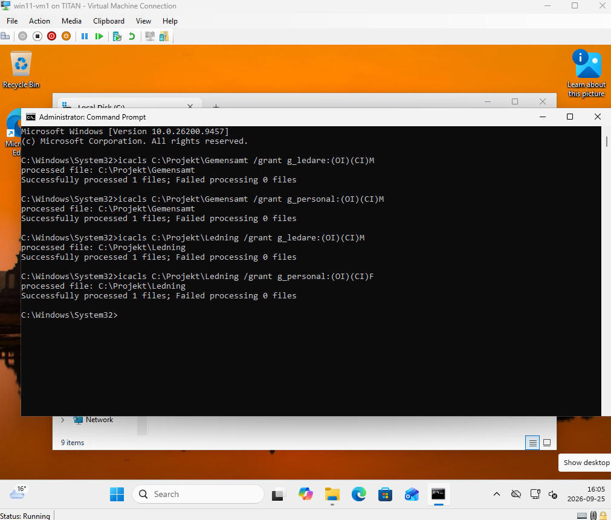  

**OPS: Skrev `/grant` iställer för `/deny` för bob ska absolute inte komma in på `/Ledning` filen.**  
**Fixa problemet genom att `/remove` Åtkomsten och sen tilldela om den rätt igen.**  

```BASH  
icacla c:\Projekt\Ledning /remove g_personal  

icacls c:\Projekt\Ledning /deny g_personal:(OI)(CI)F 

#`icacls` Verktyg i windows som styr behörighertna på filer och mappar.  
#`grant` Ge/tillåt.
#`deny` Neka.
#`OI` Gäller för alla filer inne i mappen.  
#`CI`  Gäller för alla udnermappar inne i mappen.  
#`M` Modify/ändra.  
#`F` Full Kontroll.

```  

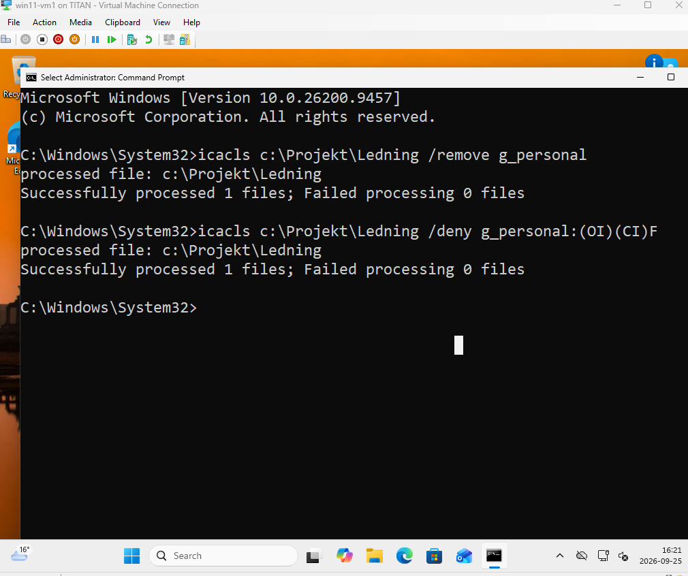  
***  

### ***steg 5:* Testa så att rätt grupp fått rätt åtkomst : JA/NEJ**  

**Bob får inte komma in på `/Ledning` filen. (Ja han har åtkomst till endast `/Gemensamt`)** 
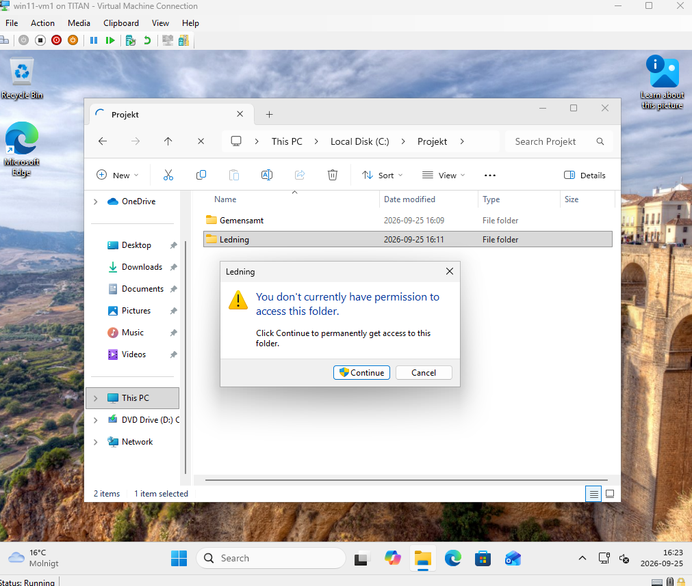  


**Alice (JA), har åtkomst till `(/Ledning och /Gemensamt)`**  
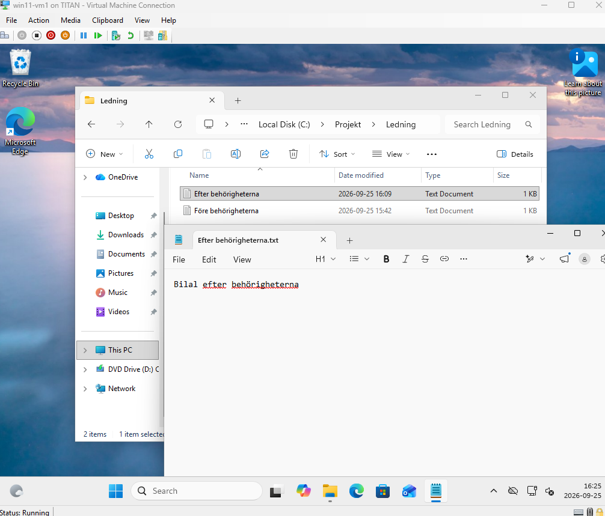
***  
***  


# Linux 🐧⬇️ 
***Förklarar Behörigheter i Linux***
**Kommandot `ls -la` visar en detaljerad lista med filernas info, behörigheter och dolda filer.**

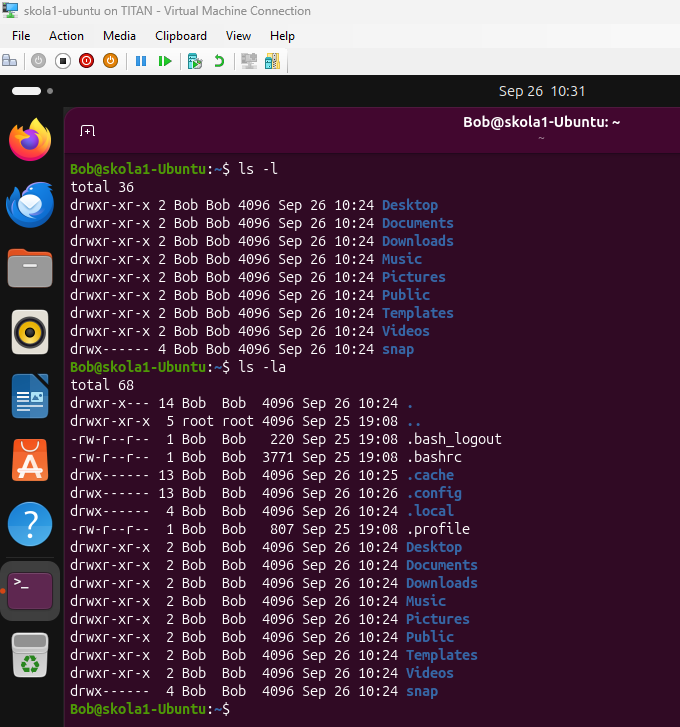


**Längst till vänster i bilden finns det `10 tecken`. Vi tar mappen `Music` som exempel:**

**`drwxr-xr-x` delar vi upp det blir det lättare: `d | rwx | r-x | r-x`**

### Första tecken visar oss filens typ om det är (fil,mapp,länk).
- `-` = vanlig **fil** (t.ex. .txt, .pdf, .jpg)
- `d` = **mapp** (Directory)
- `l` = **länk** (genväg till en annan fil)

**Tecken 2 till 10 ( d | `rwx | r-x | r-x` ) Bokstäverna betyder:**
- `r` = **Read**: får läsa
- `w` = **Write**: får ändra/skriva
- `x` = **Execute**: får köra filen (på en mapp: får gå in i den med `cd`)
- `-` = **Nej**: får inte  


| Tecken | Vem | Music | Betyder |
|---|---|---|---|
| 2–4 | **User**: ägaren | `rwx` | Får läsa, skriva och köra |
| 5–7 | **Group**: användare i samma grupp | `r-x` | Får läsa och köra, **inte** skriva |
| 8–10 | **Others**: alla andra på datorn | `r-x` | Får läsa och köra, **inte** skriva |

---

> 💡 **Tänk på det som ett hus:**
> **Ägaren** har alla nycklar. **Familjen (gruppen)** får komma in och titta men inte bygga om. **Gäster (others)** får samma sak som familjen här, fast de ofta får mindre.

***  

**Förklarar kommando Linux**  

- **setfacl :** Verktyg som styr ACL behörighertna på filer och mappar.
- **(-aG) :** -a=användare G=Group (-aG)=lägg till användare `Bilal` i group `Världensbästa`  
- **(-R) :** Gäller för alla mappar och udnermappar inne i mappen som finns just nu.  
- **(-d) :** Gör att alla nya framtida filer och undermappar som skapas i mappen automatiskt ärver samma behörigheter.  
- **(-m) :** Modify ändrar/lägger till behörighet.
***  


### ***steg 1:* Skapa Users**  
- Alice  
- Bob  

```BASH  
sudo adduser Alice #Skapar User Alice
sudo adduser Bob #Skapar user Bob
```

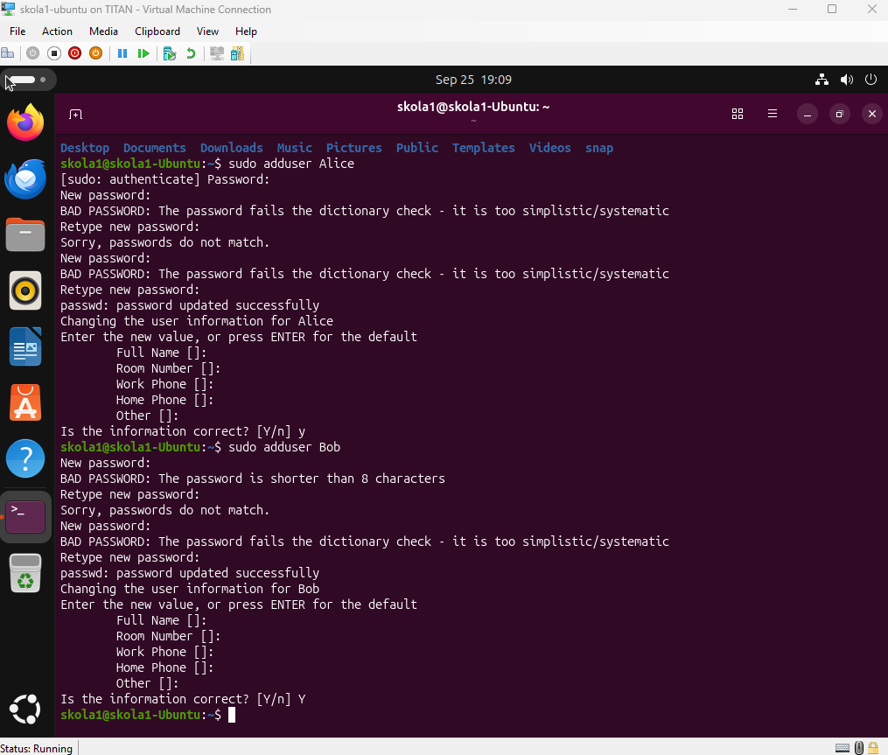  
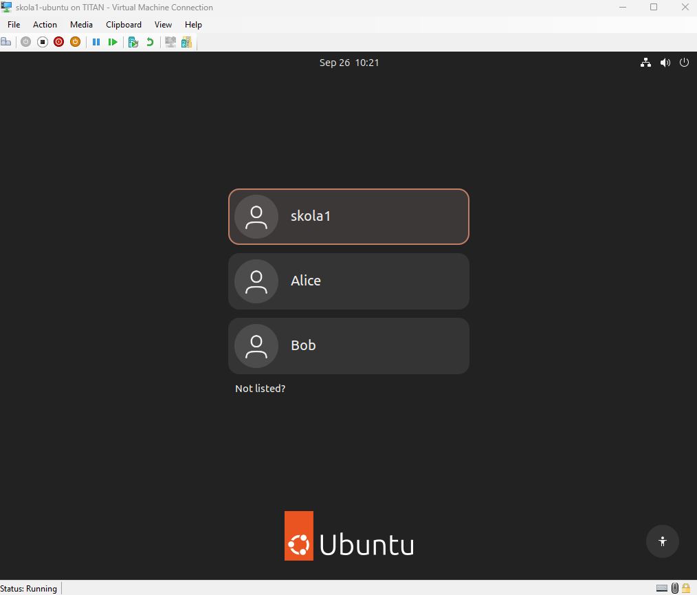
***  

### ***steg 2:* Skapa Grupperna och lägger till Users i Grupperna**  
- g_ledare (Alice) 
- g_personal (Bob)  
```BASH  
sudo groupadd g_ledare #Skapar gruppen g_ledare
sudo groupadd g_personal #Skapar gruppen g_personal 

sudo usermod -aG g_ledare Alice #Lägger till Alice i gruppen g_ledare
sudo usermod -aG g_personal Bob #Lägger till Bob i gruppen g_personal

#(-aG) = -a=användare G=Group (-aG)=lägg till användare `Bilal` i group `Världensbästa`. 

groups Alice #visar vilken grup Alice är med
groups Bob #visar vilken grup Bob är med
```

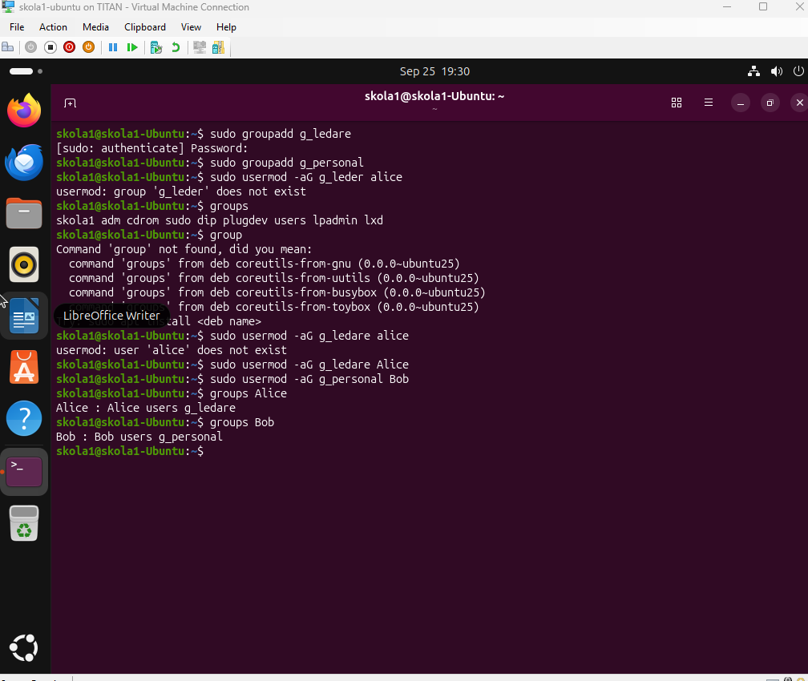
***  

### ***steg 3:* Skapa filen Projekt med två undermappar *(Ledning, Gemensamt)***  
- Projekt  
  - Ledning  
  - Gemensamt   

**VIKTIGT: Dessafielrna kommer ligga direkt på `/` eftersom om jag skapar dessa filer på en User-filer (Bob, Alice, skola1 ) då kommer systemet blockera andra från att titta i, därför väljer jag att skapa det på `/` så att alla har åtkomst till**  
```BASH  
sudo mkdir -p Projekt/Ledning #Skapade path filer
sudo mkdir -p Projekt/Gemensamt #skapde även Gemensamt filen i Projekt filen

```  

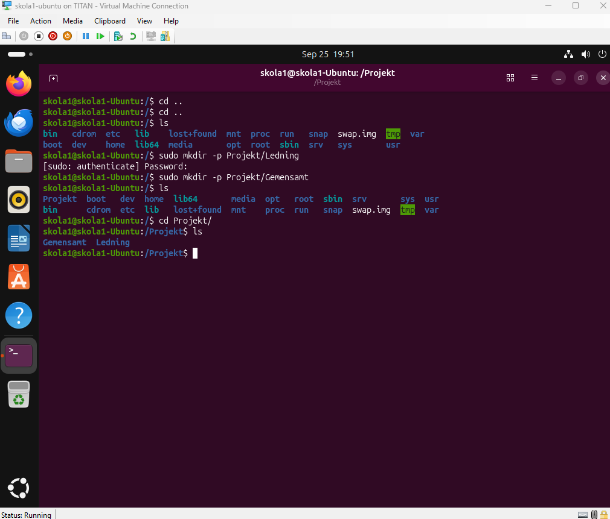  

***  

### ***steg 4:* Tilldela rätt Åtkomast enligt `arv`**  
- ***Ledning***  
  - g_ledare (Alice)(Läsa/skriva)  
  - g_personal (bob)(Ingen åtkomst)  
- ***Gemensamt***  
  - g_ledare (Alice)(Läsa/skriva)  
  - g_personal (bob)(Läsa/skriva)   

```BASH  
sudo setfacl -R -m g:g-ledare:rwx /Projekt/Ledning
sudo setfacl -d -m g:g-ledare:rwx /Projekt/Ledning  

sudo setfacl -R -m g:g-personal:--- /Projekt/Ledning
sudo setfacl -d -m g:g-personal:--- /Projekt/Ledning
#-------
sudo setfacl -R -m g:g-ledare:rwx /Projekt/Genomsamt
sudo setfacl -d -m g:g-ledare:rwx /Projekt/Genomsamt 

sudo setfacl -R -m g:g-personal:rwx /Projekt/Genomsamt
sudo setfacl -d -m g:g-personal:rwx /Projekt/Genomsamt

#(setfacl) = Verktyg som styr ACL behörighertna på filer och mappar.   
#(-R) = Gäller för alla mappar och udnermappar inne i mappen som finns just nu.  
#(-d) = Gör att alla nya framtida filer och undermappar som skapas i mappen automatiskt ärver samma behörigheter.  
#(-m) = Modify ändrar/lägger till behörighet.
```  

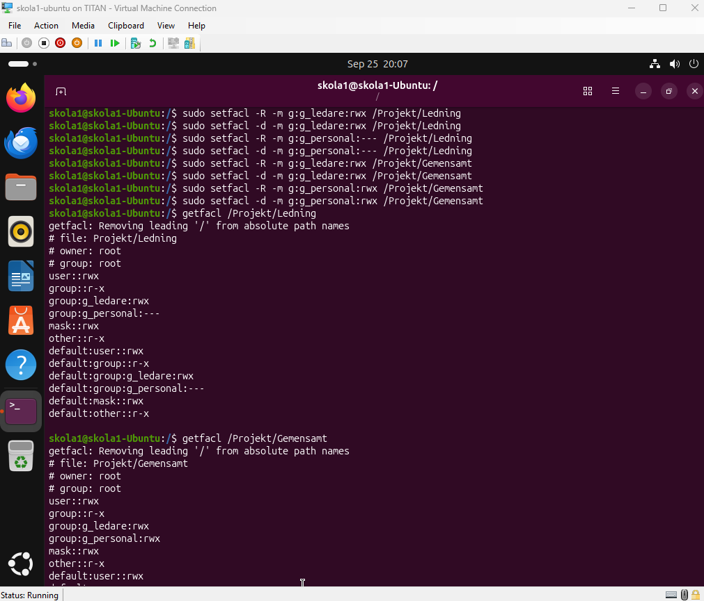 


***  

### ***steg 5:* Testa så att rätt grupp fått rätt åtkomst : JA/NEJ**

```BASH  
getfacl /Projekt/Ledning #Visar alla rättigheterna för filen Ledning.

getfacl /Projekt/Gemensamt #Visar alla rättigheterna för filen Gemensamt.

```

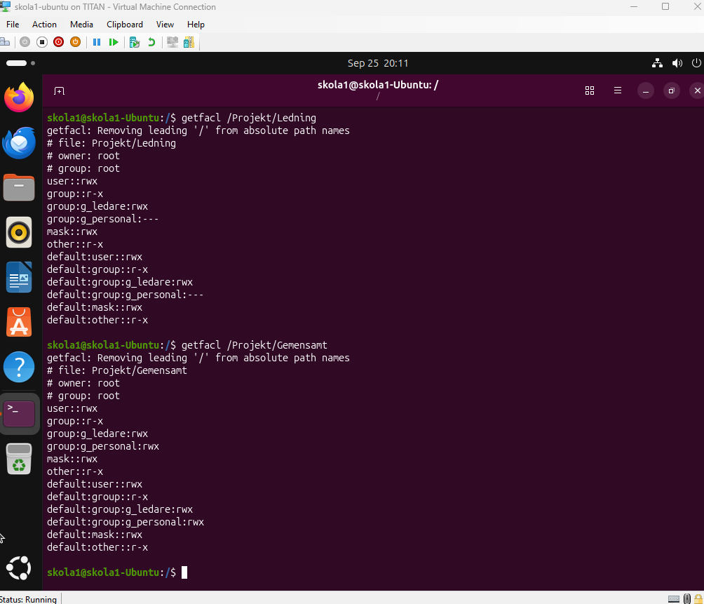


//Bilal Al Ali